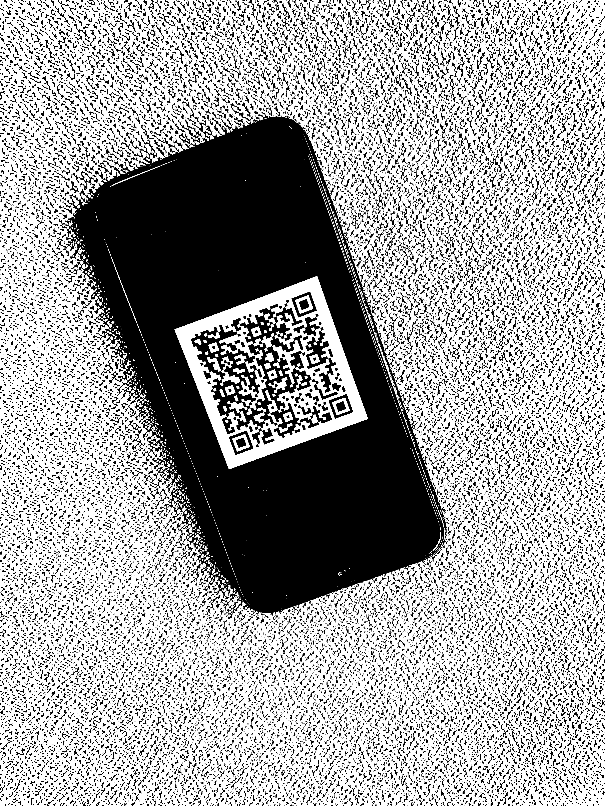
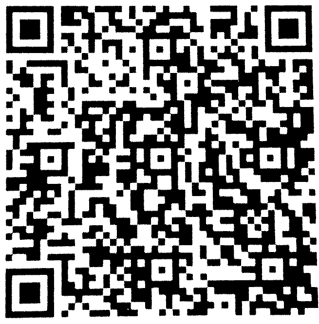

# QR Code Reader

## Project Description

Write a QR code finder and decoder in pure Python, without the help of any computer vision libraries.
A pure Python library is a library that only contains Python code, and doesn't include, say, C extensions or code in other languages.

## Project Goal

- Waypoint 1: Load Image and Correct Orientation
- Waypoint 2: Convert Image to Monochrome
- Waypoint 3: Determine Image Brightness
- Waypoint 4: Filter Visible Sprites
- Waypoint 5: Filter Square Sprites
- Waypoint 6: Filter Dense Sprites
- Waypoint 7: Group Sprites by Similar Size and Distance
- Waypoint 8: Search Position Detection Patterns
- Waypoint 9: Filter Matching Inner and Outer Finder Patterns
- Waypoint 10: Crop the QR Code Image Portion
- Waypoint 11: Find QR Code Symbol Version
- Waypoint 12: Convert a QR Code Symbol to an Array of Bits
- Waypoint 13: Decode a QR Code Symbol

## Project Benefit

You can decode your QR Code Image with this project

## Technology

- Python (PIL, Numpy, Sprite util)

## Project Team

- Lam Khang Tran

## Usage

### Install New Python 3.7.4

Go to this link and download new python version: https://www.python.org/downloads/

### Install packages: pillow (PIL), numpy, Sprite util
You have to install packages above:

```bash
pip install pillow
```

and

```bash
pip install numpy
```

and

```bash
pip install spriteutils-pkg
```

### Clone this repository:
```bash
git clone https://github.com/kangkang2410/QR-Code-Reader/
```

### Test case
Using first_original.jpg


```python
image = load_image_and_correct_orientation("./first_original.jpg")
monochrome_image = monochromize_image(image, 0.45)
monochrome_image.save("first_original.png")
```

After these above code, you will have first_original.png as same as image below:



Next, do the following code below:
```python
# Open image and detect sprite sheet by spriteutils
image = Image.open("./first_original.png")
sprite_sheet = SpriteSheet("./first_original.png")
sprites, label_map = sprite_sheet.find_sprites()

# Filter sprites following: visible, square, dense
visible_sprites = filter_visible_sprites(sprites, 2048)
square_sprites = filter_square_sprites(visible_sprites, 0.23)
dense_sprites = filter_dense_sprites(square_sprites, 0.22)

# Group sprite by similar size and distance
similar_size_distance_group = group_sprites_by_similar_size_and_distance(square_sprites, 0.05, 0.05)

# Find patterns with orthogonal angle
finder_patterns = search_position_detection_patterns(similar_size_distance_group, 0.005)

# Get outer patterns of QR Code
outer_patterns = filter_matching_inner_outer_finder_patterns(finder_patterns)

# Crop QR Code image
qr_code_image_portion_cropped = crop_qr_code_image(image, outer_patterns)
qr_code_image_portion_cropped.save("first_image_cropped.png")
```
Your final result:



You can test with many different cases of image, but each image will have diffent threshold to filter sprite. So try it yourself!!!

**Note**: You can test with my second_original.jpg following threshold below:
- min_surface_area: 10240
- similarity_threshold: 0.3
- density_threshold: 0.3
- similar_size_threshold: 0.1
- similar_distance_threshold: 0.1
- orthogonality_threshold: 0.1

Thanks for reading my project :>

## Contact (Author & Maintainer)

- Name: Khang TRAN
- Email: haphongpk12@gmail.com
- Facebook: https://www.facebook.com/haphongpk12
- Phone: (+84) 909 77 8046